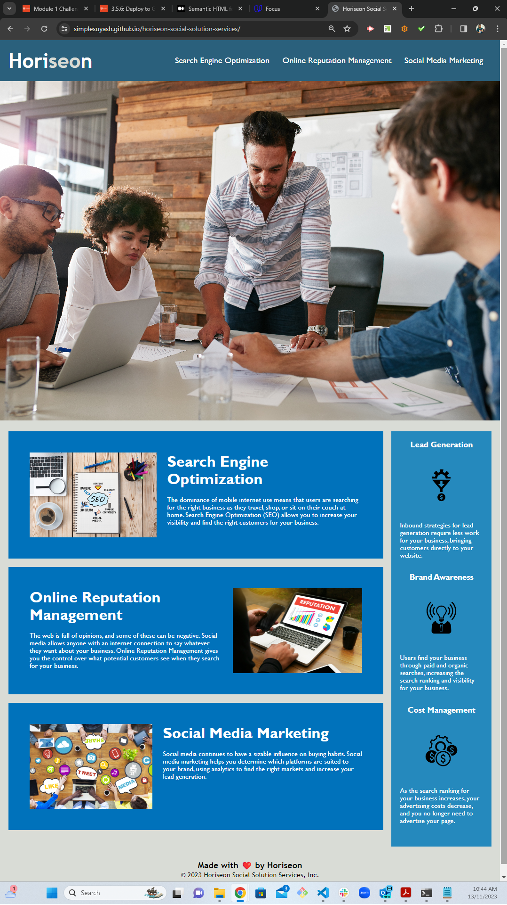

# horiseon-marketing-agency

Horiseon Marketing Agency website optimization for search engines by following accessibility standards

## Description

Horiseon is a marketing agency that wanted a codebase which follows accessibility standards, so their website is optimized for search engines. Even though accessibility is a broad topic that can include complex requirements, this projects aims to address a small list of specific criteria, which are documented in the Acceptance Criteria section below.

### Acceptance Criteria
    GIVEN a webpage meets accessibility standards
    WHEN I view the source code
    THEN I find semantic HTML elements
    WHEN I view the structure of the HTML elements
    THEN I find that the elements follow a logical structure independent of styling and positioning
    WHEN I view the image elements
    THEN I find accessible alt attributes
    WHEN I view the heading attributes
    THEN they fall in sequential order
    WHEN I view the title element
    THEN I find a concise, descriptive title
  

Basically, the codebase is refactored to accomodate long-term sustainability. The refactoring ensures the links in the primary navigation are functioning correctly, CSS selectors and properties are consolidated and organized to follow the semantic structure of the HTML in order to make CSS more efficient, and sections and elements of the page are appropriately commented.

Finally, when the webpage is deployed, it loads with no errors and warnings, and it is 100% SEO compliant.

## Screenshot

## Link to Deployed Application

git@github.com:SimpleSuyash/horiseon-marketing-agency.git

https://simplesuyash.github.io/horiseon-social-solution-services/
